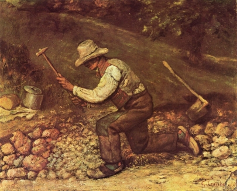

# Stonebreaker

||||
|-|:-:|-|
||A worker||

Tool for project tracking (for an agile based projects):
  - Forms for data per user story.

## Changes and some thougts
  ~~1. Written in Elm: I want writing front-end web applications in any functional language and Elm is designed specifically for such task.
  2. DB: pouchDB/couchDB~~
  
  This is going nowhere. Must restart with a more simple approach, not the full mind blowing SPA. 
  __Step by step.__
